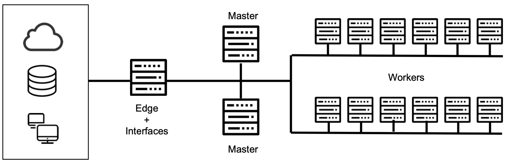
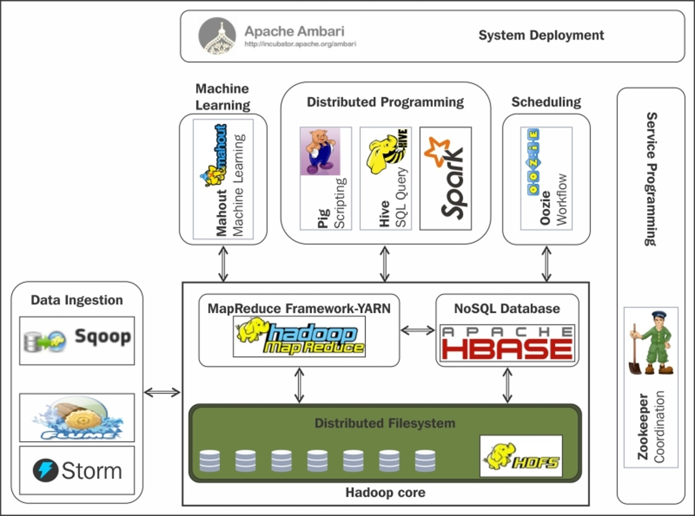
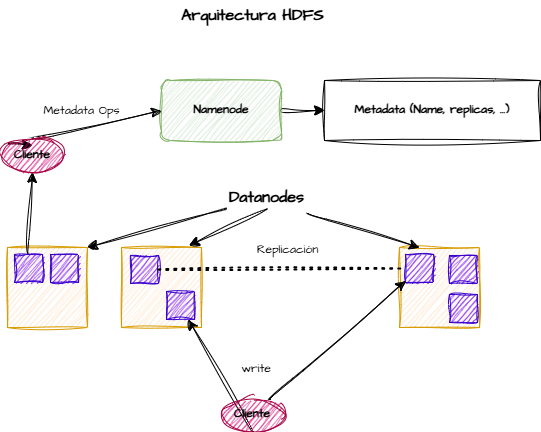

# Hadoop - Big Data Aplicado

## Índice

- Introdución  
- Procesamento distribuído  
- Compoñentes e ecosistema  
- HDFS  
- YARN  
- Bibliografía  

---

## Introdución

Proxecto *open source* composto por unha serie de ferramentas que permiten o procesamento distribuído de grandes cantidades de datos a través de clústeres de ordenadores.

**Características:**

- **Confiable:** Replica os datos de forma automática  
- **Tolerante a erros:** Recupérase automaticamente tras producirse erros  
- **Escalable:** Pode distribuírse ata en miles de máquinas, cada unha con procesamento e almacenamento  
- **Portable:** Funciona en diversos tipos de hardware e sistemas operativos  


---

## Procesamento distribuído

### Nodos Mestres
- Encargados dos procesos de xestión global  
- Controlan a execución de traballos e almacenamento de datos  
- Normalmente necesítanse 3  
- Requisitos hardware máis esixentes  

### Nodos Workers
- Manexan datos locais e procesos de aplicación  
- Número moi variable (3-10.000)  
- Hardware relativamente “barato”  

### Nodos Edge
- “Ponte” entre o clúster e a rede exterior  
- Proporcionan interfaces  

---

## Compoñentes e ecosistema

### Núcleo Hadoop
- **Hadoop Common:** Utilidades comúns  
- **HDFS:** Sistema de ficheiros distribuído  
- **YARN:** Xestor de recursos  
- **MapReduce:** Sistema de procesamento paralelo  

### Ferramentas complementarias

- **Hive:** Acceso a HDFS como se fose unha BD relacional  
- **HBase:** BD NoSQL distribuída e escalable  
- **Pig:** Linguaxe declarativa que traduce a MapReduce (en desuso)  
- **Sqoop:** Transferencia de datos entre BBDD relacionais e Hadoop  
- **Flume:** Recolección e distribución de datos en arquitecturas streaming  
- **Zookeeper:** Coordinación de aplicacións distribuídas  
- **Spark:** Procesamento en memoria eficiente, alternativa a MapReduce  
- **Ambari:** Instalación, configuración e monitorización  
- **Kafka:** Broker de mensaxería tipo publisher-subscriber  
- **Airflow:** Creación e xestión de fluxos de datos  
- **Hue:** Interfaz gráfica para interactuar con Hadoop  

---

## HDFS

- Capa de almacenamento de Apache Hadoop  
- Baseado en GFS (Google File System)  
- Divide os datos en bloques (por defecto, 128MB)  
- Repárteos a través dos nodos  

**Limitacións:**

- Non apto para:
  - Accesos de baixa latencia  
  - Ficheiros pequenos  
  - Múltiples escritores  
  - Modificacións arbitrarias  


### Tipos de máquinas:

- **Namenode:** Almacena metadatos e controla a localización dos bloques  
- **Datanode:** Almacena os bloques  
- **Secondary Namenode:** Xera puntos de control (snapshots) dos metadatos  

---

## MapReduce

Paradigma funcional en dúas fases:
- **Map:** Divide os datos e xera pares clave-valor  
- **Reduce:** Agrega os resultados

### Exemplo: WordCount

```
Map: Os documentos transfórmanse en pares (palabra, 1)  
Reduce: Agrúpanse por palabra e súmanse as ocorrencias
```

---

## YARN

**Yet Another Resource Negotiator**

- Xestor de recursos desde Hadoop v2  
- Separa a xestión de recursos das tarefas MapReduce  
- Permite compartir recursos entre distintas aplicacións

### Obxectivos:

- Separar xestión de recursos da execución  
- Permitir maior liberdade de implementación de aplicacións  

### Compoñentes:

- **Resource Manager:** Xestiona nodos, asigna recursos e controla execución  
  - *Scheduler:* Distribúe recursos  
  - *Application Manager:* Acepta solicitudes  

- **Node Manager:**  
  - Monitoriza recursos nos nodos  
  - Supervisa contedores e tarefas  
  - Lanza ApplicationMaster  

- **Application Master:**  
  - Negocia recursos  
  - Supervisa execución da aplicación  
  - Un por aplicación  

---

## Configuración dun clúster Hadoop en Docker

- Baseado en **Ubuntu 20.04** por compatibilidade con Java  
- Crear e configurar un `Dockerfile` con configuracións e variables de entorno  
- Crear un `docker-compose` cos servizos:

```yaml
- namenode:
    ports: 9000, 9870, 50070
    command: hdfs namenode

- datanode (varios):
    command: hdfs datanode

- resourcemanager:
    ports: 8088
    command: yarn resourcemanager

- nodemanager:
    command: yarn nodemanager
```

**Repositorio:**  
[https://github.com/adbgonzalez/hadoop-cluster](https://github.com/adbgonzalez/hadoop-cluster)

---

## Exemplo: WordCount

### Subida e execución

```bash
# Subir ficheiro a contedor
docker cp arquivo.txt nome_contedor:/ruta_absoluta

# Crear directorio en HDFS
hdfs dfs -mkdir -p /ruta

# Subir ficheiro a HDFS
hdfs dfs -put arquivo.txt /ruta
```

### Executar exemplo (en Java)

```bash
hadoop jar $HADOOP_HOME/share/hadoop/mapreduce/hadoop-mapreduce-examples-3.3.6.jar   wordcount /user/root/elquijote.txt /user/root/salidaWC
```

### Versión en Python

```bash
# mapper.py e reducer.py deben estar creados
mapred_streaming   -input ficheiro_entrada   -output directorio_saida   -mapper mapper.py -file mapper.py   -reducer reducer.py -file reducer.py
```

---

## Bibliografía

- **Documentación oficial:** Apache Hadoop 3.4.1  
- **Apuntes:** Aitor Medrano – https://aitor-medrano.github.io
