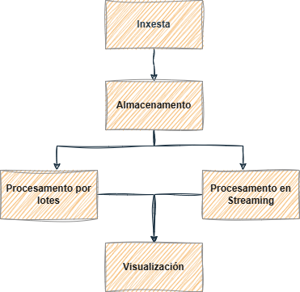
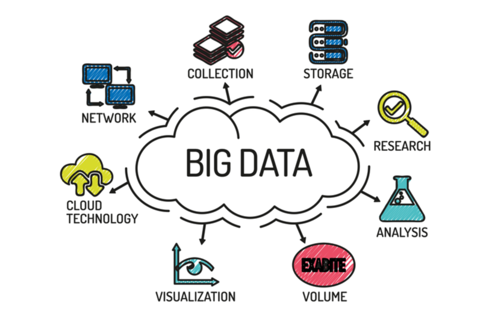

# Introdución **Big Data**

---
## 1. Que é o Big Data?

**Big Data** refírese ao conxunto de datos que, polo seu **volume**, **variedade** e **velocidade** de xeración, superan as capacidades das ferramentas tradicionais de procesamento e análise.

Non se trata só da cantidade de datos, senón de como xestionalos, procesalos e extraer valor deles.

### As 5 V's do Big Data
Aínda que ao principio eran 3, agora considérase que estas son as 5 características fundamentais que definen un sistema *Big Data*:

| V              | Significado                                                                          |
| -------------- | ------------------------------------------------------------------------------------ |
| **Volume**     | Grandes cantidades de datos (terabytes, petabytes…).                                 |
| **Velocidade** | Xeración e procesamento de datos en tempo real ou case real.                         |
| **Variedade**  | Datos estruturados, semiestruturados (XML, JSON) e non estruturados (vídeo, texto…). |
| **Veracidade** | Fiabilidade, calidade e consistencia dos datos.                                      |
| **Valor**      | Capacidade de obter coñecemento útil ou predicións a partir dos datos.               |

### A orixe do Big Data
Estas son as razóns que impulsaron o nacemento do **Big Data**:
- A dixitalización masiva (móbiles, sensores, redes sociais...).
- A necesidade de tomar decisións baseadas en datos (data-driven).
- A aparición de tecnoloxías "baratas" de almacenamento e procesamento distribuído.

### Arquitectura típica dun sistema Big Data
1. **Inxesta de datos**: Captación de datos dende múltiples fontes: webes, sensores, APIs...).
2. **Almacenamento**: Gardar datos nun formato escalable, normalmente distribuído (*HDFS*, *S3*, *Delta Lake*...).
3. **Procesamento**: Limpeza, transformación e análise de datos (*Apache Spark*, *Apache Beam*, *Apache Flink*...).
4. **Visualización**: Creación de informes e dashboards (*Power BI*, *Tableau*, *Superset*...).
5. **Gobernanza/orquestración**: Control de acceso, seguridade, calidade de datos (*Apache Airflow*, *Apache Nifi*, *Ozie*...).

### Retos do Big Data
A día de hoxe, estes son os principais retos do **Big Data**:
- Escalabilidade e rendemento.
- Garantir a calidade dos datos.
- Protexer a privacidade e a seguridade.
- Xestionar a complexidade das infraestruturas.
- Interpretar correctamente os resultados.

## 2. Contexto: profesións e perfís relacionados cos datos

A xestión de grandes volumes de datos non é un fin en si mesmo, senón un medio para obter información, tomar decisións mellores ou automatizar procesos. Neste contexto existen distintos **perfís profesionais** que traballan con datos:

### Analista de datos (*Data Analyst*)
- Usa ferramentas como Excel, SQL ou Power BI para responder preguntas de negocio.
- Explora, visualiza e comunica resultados.
- Traballa sobre datos xa limpos e preparados.

### Enxeñeiro/a de datos (*Data Engineer*)
- Constrúe a infraestrutura para que os datos poidan ser almacenados, procesados e consumidos.
- Usa ferramentas como Spark, Kafka, Airflow, HDFS...
- Encárgase da calidade, integridade e dispoñibilidade dos datos.

### Científico/a de datos (*Data Scientist*)
- Aplica modelos estatísticos ou de *machine learning* para descubrir patróns ou facer predicións.
- Usa Python, R, notebooks, bibliotecas de IA.
- Precisa datos preparados previamente pola enxeñaría de datos.

> Neste módulo imos traballar sobre todo as tarefas propias da **enxeñaría de datos**, pero tocando tamén parte do traballo analítico.

---

## 3. Tecnoloxías que imos empregar (e alternativas por categoría)

### Almacenamento distribuído
**Ferramentas do curso**:
- **HDFS** – sistema de ficheiros distribuído, tolerante a fallos.
- **MinIO** – almacenamento obxectual compatible con Amazon S3.

**Outras alternativas**:
- Amazon S3, Azure Data Lake, Google Cloud Storage, Ceph.

---

### Procesamento de datos
**Ferramenta principal**:
- **Apache Spark** (PySpark): para procesamento batch, SQL e streaming.

**Alternativas coñecidas**:
- Apache Flink, Apache Beam, Hive, Presto, Dask.

---

### Inxestión e fluxo de datos
**Ferramentas empregadas**:
- **Apache NiFi** – deseño gráfico de fluxos de datos.
- **Apache Airflow** – planificación e orquestración de tarefas.

**Alternativas populares**:
- Talend, StreamSets, Dagster, Data Factory, AWS Glue.

---

### Comunicación entre sistemas
**Ferramenta opcional e avanzada**:
- **Apache Kafka** – mensaxería distribuída para arquitecturas orientadas a eventos.

**Outras opcións**:
- RabbitMQ, Pulsar, MQTT, EventHub, Pub/Sub.

---

### Visualización e exploración de datos
**Ferramentas que imos usar**:
- **Superset** / **Metabase** – dashboards sobre datos SQL.
- **JupyterLab** – análise en Python con Pandas e visualizacións.

**Alternativas comerciais**:
- Power BI, Tableau, Looker, QuickSight.

---

## 4. Dúas opcións arquitectónicas: solución comercial ou personalizada

| Opción                           | Características                                                  | Vantaxes                                                | Riscos ou custos                                    |
|----------------------------------|------------------------------------------------------------------|---------------------------------------------------------|-----------------------------------------------------|
| **Solución comercial integral** | Plataforma unificada na nube con servizos integrados             | Sinxeleza, rapidez de posta en marcha, rendemento alto | Custos por uso, dependencia do provedor             |
| **Arquitectura personalizada**  | Montaxe combinada con ferramentas libres e autoaloxadas          | Control total, aprendizaxe profunda, custo baixo       | Complexidade inicial, mantemento                   |

> 🔧 No curso imos construír unha **arquitectura personalizada**, que permita ao alumnado:
> - Entender cada compoñente tecnolóxico.
> - Adaptarse máis tarde a plataformas comerciais como Databricks, Fabric ou Confluent.

---

## 5. Solucións comerciais end-to-end: descrición e relación coas tecnoloxías

### 🔹 Databricks
- Plataforma cloud creada polos fundadores de Apache Spark.
- Baseada nun modelo *Lakehouse*: datos en bruto e refinados no mesmo sistema.
- Incorpora: Spark, Delta Lake, clusters autoxestionados, notebooks, MLflow, orquestración.
- **Tecnoloxías similares vistas no curso**: Spark, MinIO/HDFS, Airflow, Superset.

---

### 🔹 Microsoft Fabric
- Plataforma unificada de datos dentro do ecosistema Microsoft 365.
- Inclúe: OneLake, Data Factory, Power BI, Notebooks, Spark engine.
- **Tecnoloxías similares vistas no curso**: MinIO, NiFi, Airflow, Spark, Superset.

---

### 🔹 Google Cloud Platform
- Ecosistema baseado en BigQuery (DWH), Dataflow (Apache Beam), Looker (BI).
- Incorpora tamén Pub/Sub (streaming).
- **Tecnoloxías similares vistas no curso**: Spark (substituído por Beam), Kafka, Superset, Airflow.

---

### 🔹 Amazon Web Services
- Plataforma modular: S3 (almacenamento), Glue (ETL), Redshift (DWH), QuickSight (BI).
- Inclúe MSK (Kafka xestionado).
- **Tecnoloxías similares vistas no curso**: MinIO, NiFi, Airflow, Spark, Kafka, Superset.

---

### 🔹 Confluent Platform
- Versión empresarial de Apache Kafka.
- Incorpora: Kafka Connect, KSQL, Schema Registry, Control Center.
- Foco en arquitecturas orientadas a eventos en tempo real.
- **Tecnoloxías similares vistas no curso**: Kafka, NiFi, Airflow.

---

### Táboa comparativa

| Plataforma        | Almacenamento | Procesamento | Inxestión / ETL      | Visualización BI | Streaming / eventos |
|------------------|----------------|--------------|-----------------------|------------------|----------------------|
| Databricks       | ADLS / S3      | ✔ Spark      | ✔ Pipelines propios   | ✔ Dashboards     | ✔ Kafka integrado    |
| MS Fabric        | OneLake        | ✔ Spark      | ✔ Data Factory        | ✔ Power BI       | EventHub (parcial)   |
| GCP              | GCS            | ✔ Beam       | ✔ Dataflow            | ✔ Looker         | ✔ Pub/Sub            |
| AWS              | S3             | ✔ Spark      | ✔ Glue                | ✔ QuickSight     | ✔ MSK (Kafka)        |
| Confluent        | Externo (S3…)  | ✖            | ✔ Kafka Connect       | Opcional         | ✔ Kafka completo     |

---

## 6. Ferramentas e contidos que se van desenvolver no curso

| Categoría              | Ferramentas ou contidos incluídos                          | Obxectivo no curso                                                 |
|------------------------|-------------------------------------------------------------|---------------------------------------------------------------------|
| Almacenamento          | HDFS, MinIO                                                  | Comprender almacenamento distribuído e obxectual                   |
| Procesamento batch     | Apache Spark + PySpark                                       | ETL e análises distribuídas con RDDs e DataFrames                  |
| Procesamento streaming | Spark Structured Streaming + fontes reais (Kafka ou APIs)   | Análise de datos en tempo real                                     |
| Inxestión / ETL        | Apache NiFi, Airflow                                         | Automatización de extracción e carga de datos                     |
| Comunicación           | Apache Kafka (teoría e práctica opcional)                   | Sistemas orientados a eventos, logs distribuídos                   |
| Visualización          | Superset / Metabase, JupyterLab                             | Dashboards e análise exploratoria                                  |
| Orquestración          | Airflow, NiFi                                                | Dependencias, planificación e control de execución de pipelines    |
| BI / análise final     | Power BI (observación), Superset (uso práctico)              | Comparativa real entre alternativas libres e comerciais             |

## 7. Glosario de termos
### Almacenamento
- **Data lake**: Repositorio de almacenamento masivo onde se gardan datos en bruto en calquera formato (non estruturados e semi-estruturados).
- **Data Warehouse**: Almacén de datos estruturados, deseñado para a análise e a toma de decisións. Habitualmente con topoloxía en estrela.
- **Delta Lake**: Capa transaccional ACID sobre un data lake que garante calidade, consistencia e control
- **Delta Table**:	Táboa en formato Delta con capacidades avanzadas de consulta e modificación de datos
### Procesamento de datos
- **Batch Processing**: Procesamento de datos en bloques ou lotes, con latencia alta pero bo rendemento para grandes volumes.
- **Streaming Processing**: Procesamento en tempo real de fluxos de datos continuamente xerados.
- **ETL (Extract, Transform, Load)**: Proceso clásico de extracción, transformación e carga de datos.
- **ELT (Extract, Load, Transform)**: Variante moderna onde os datos se cargan primeiro e logo se transforman no destino.
### Análise e ciencia de datos
- **DataFrame**: Estrutura de datos tabular usada en Spark e Pandas.
- **Data Profiling**: Técnica para analizar a estrutura, calidade e estatísticas dos datos.
- **Feature Engineering**: Proceso de transformación de datos en características relevantes para modelos de aprendizaxe automática.
- **Model Deployment**: Fase de despregue dun modelo para que poida ser usado en produción.
### Visualización e ciencia de datos
- **Dashboard**: Panel visual que presenta indicadores clave e métricas en tempo real.
- **KPIs (Key Performance Indicators)**: Métricas críticas que indican o rendemento dos procesos de negocio.
### Calidade, monitorización e seguridade
- **Data Lineage**: Seguimento da orixe e transformación dos datos ao longo do seu ciclo de vida.
- **Observabilidade de datos**: Capacidade de rastrear, monitorizar e alertar sobre problemas nos fluxos de datos.
- **Data Governance**: Políticas e prácticas para asegurar o uso responsable, seguro e legal dos datos.
- **DLP (Data Loss Prevention)**: Conxunto de ferramentas para evitar a fuga de información sensible.
### Arquitectura
- **Lambda Architecture**: Modelo que combina procesamento batch e streaming para unha análise máis completa.
- **Kappa Architecture**: Variante que usa só fluxos de datos en tempo real, simplificando o deseño.
- **Medallion Architecture**: Arquitectura por capas (bronze, silver, gold) para mellorar a calidade dos datos progresivamente.
### Outros conceptos
- **Metadata**: Datos que describen outros datos (estructura, tipo, fonte...).
- **Schema Evolution**: Capacidade dun sistema para adaptar cambios no esquema dos datos.
- **Partitioning**: Técnica para dividir grandes conxuntos de datos en subconxuntos máis pequenos para mellorar o rendemento.
- **Shuffling**: Redistribución de datos entre tarefas no proceso de agrupación ou combinación en Spark.
